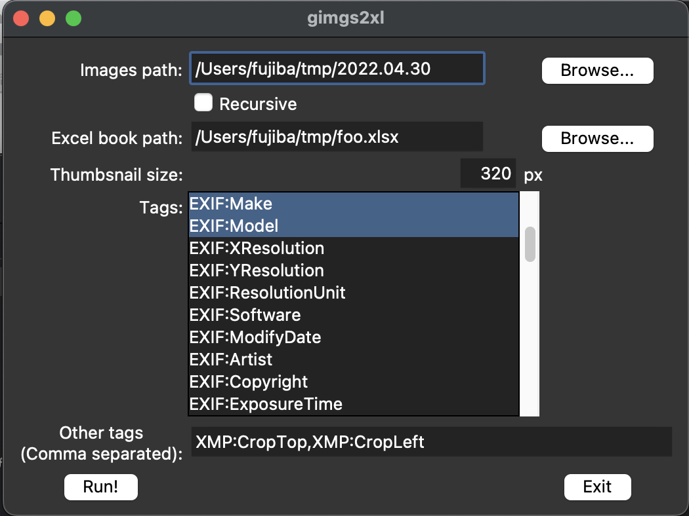

# imgs2xl
Generate an Excel sheet with thumbnails from an image files.

# Description

This tool reads image files in a specified directory and generates an Excel sheet with thumbnails. It can optionally add specified Exif tags to the list.


# Install

```bash
pip install git+https://github.com/fujiba/imgs2xl
```

# Usage

## CLI

imgs2xl.py [-h] [--recursive] [--verbose] [--size SIZE] [--input-json INPUT_JSON]
                  [--generate-skeleton GENERATE_SKELETON] [--tags TAGS]
                  [inputdir] [output]

positional arguments

| Argument         | Description                               |
|------------------|-------------------------------------------|
| inputdir         | Input directory that contain image files. |
| output           | Output Excel file name.                   |

optional arguments:

| Argument                              | Description                               |
|---------------------------------------|-------------------------------------------|
| -h, --help                            | show this help message and exit           |
| --size SIZE                           | Thumbnails size.(default 320px)           |
| --tags TAGS                           | Append exif tags. If specify the multiple tags, use commna for separate.The tag names may include group names, asusual in the format `<group>:<tag>`. |
| --input-json INPUT_JSON               | Use parameters json file.                 |
| --generate-skeleton GENERATE_SKELETON | Create parameters skeleton json file.     |
| --recursive                           | Recursively search for files.             |
| --verbose                             | Verbose mode(default False)               |

example

```bash
imgs2xl imgsdir imglist.xlsx --size 240 --tags Model,LensModel,DateTimeOriginal
```

### Input JSON

The imgs2xl is using parameters as JSON file. JSON file sample is following.

```json
{
  "inputdir": "/Users/fujiba/tmp/2022.04.25",
  "output": "/Users/fujiba/tmp/hoge.xlsx",
  "recursive": false,
  "size": 320,
  "tags": ["EXIF:Make", "EXIF:Model"]
}
```

To generate a skeleton file is calling `imgs2xl --generate-skeleton jsonfilename`.

## GUI

```bash
gimgs2xl
```



| UI Element       | Description                                                          |
|------------------|----------------------------------------------------------------------|
| Images path      | Input directory that contain image files.                            |
| Recursive        | Recursively search for files.                                        |
| Excel book path  | Output Excel file name.                                              |
| Thumbsnail size  | Thumnbsnails size.                                                   |
| Tags             | Famous tags are can select multiple.                                 |
| Other tags       | Specify a tag that is not in the list above, use comma for separate.The tag names may include group names, asusual in the format `<group>:<tag>`. |
| Run!             | Execute an imgs2xl to output Excel book.                             |
| Exit             | Exit this programm.                                                  |

| Menu Item        | Description                                                          |
|------------------|----------------------------------------------------------------------|
| Load param...    | Load parameters from JSON.                                           |
| Save param...    | Save parameters to JSON.                                             |
| Exit             | Exit this programm.                                                  |

See following youtube contents for using gimgs2xl.

[](https://www.youtube.com/watch?v=XBRdQukC33M)

# Requirements

- Python >= 3.9
  - openpyxl
  - Pillow
  - filetype
  - defusedxml

GUI application is using `tkinter`. When happen a following error, you need install `python-tk`.

```
 File “/opt/homebrew/Cellar/python@3.9/3.9.5/Frameworks/Python.framework/Versions/3.9/lib/python3.9/tkinter/__init__.py”, line 37, in <module>

  import _tkinter # If this fails your Python may not be configured for Tk

ModuleNotFoundError: No module named ‘_tkinter’
```

To install `tkinter`, do the following.

* macOS
```bash
brew install python-tk
```

* linux(ubuntu)
```bash
sudo apt install python-tk
```

# Author

- [T.Fujiba]("https://github.com/fujiba/")
  - Web: https://www.fujiba.net/
  - Twitter: [@fujiba](https://twitter.com/fujiba)

# License

MIT License

# Appendix

## Metadata (File/Exif/XMP) tag names

| Tag name |
|----------|
|File:Filename|
|File:Directory|
|File:FileSize|
|File:FileModifyDate|
|File:FileAccessDate|
|File:FileType|
|File:FileTypeExtension|
|File:MIMEType|
|File:ImageWidth|
|File:ImageHeight|
|EXIF:InteropIndex|
|EXIF:ProcessingSoftware|
|EXIF:NewSubfileType|
|EXIF:SubfileType|
|EXIF:ImageWidth|
|EXIF:ImageLength|
|EXIF:BitsPerSample|
|EXIF:Compression|
|EXIF:PhotometricInterpretation|
|EXIF:Thresholding|
|EXIF:CellWidth|
|EXIF:CellLength|
|EXIF:FillOrder|
|EXIF:DocumentName|
|EXIF:ImageDescription|
|EXIF:Make|
|EXIF:Model|
|EXIF:StripOffsets|
|EXIF:Orientation|
|EXIF:SamplesPerPixel|
|EXIF:RowsPerStrip|
|EXIF:StripByteCounts|
|EXIF:MinSampleValue|
|EXIF:MaxSampleValue|
|EXIF:XResolution|
|EXIF:YResolution|
|EXIF:PlanarConfiguration|
|EXIF:PageName|
|EXIF:FreeOffsets|
|EXIF:FreeByteCounts|
|EXIF:GrayResponseUnit|
|EXIF:GrayResponseCurve|
|EXIF:T4Options|
|EXIF:T6Options|
|EXIF:ResolutionUnit|
|EXIF:PageNumber|
|EXIF:TransferFunction|
|EXIF:Software|
|EXIF:DateTime|
|EXIF:Artist|
|EXIF:HostComputer|
|EXIF:Predictor|
|EXIF:WhitePoint|
|EXIF:PrimaryChromaticities|
|EXIF:ColorMap|
|EXIF:HalftoneHints|
|EXIF:TileWidth|
|EXIF:TileLength|
|EXIF:TileOffsets|
|EXIF:TileByteCounts|
|EXIF:SubIFDs|
|EXIF:InkSet|
|EXIF:InkNames|
|EXIF:NumberOfInks|
|EXIF:DotRange|
|EXIF:TargetPrinter|
|EXIF:ExtraSamples|
|EXIF:SampleFormat|
|EXIF:SMinSampleValue|
|EXIF:SMaxSampleValue|
|EXIF:TransferRange|
|EXIF:ClipPath|
|EXIF:XClipPathUnits|
|EXIF:YClipPathUnits|
|EXIF:Indexed|
|EXIF:JPEGTables|
|EXIF:OPIProxy|
|EXIF:JPEGProc|
|EXIF:JpegIFOffset|
|EXIF:JpegIFByteCount|
|EXIF:JpegRestartInterval|
|EXIF:JpegLosslessPredictors|
|EXIF:JpegPointTransforms|
|EXIF:JpegQTables|
|EXIF:JpegDCTables|
|EXIF:JpegACTables|
|EXIF:YCbCrCoefficients|
|EXIF:YCbCrSubSampling|
|EXIF:YCbCrPositioning|
|EXIF:ReferenceBlackWhite|
|EXIF:XMLPacket|
|EXIF:RelatedImageFileFormat|
|EXIF:RelatedImageWidth|
|EXIF:RelatedImageLength|
|EXIF:Rating|
|EXIF:RatingPercent|
|EXIF:ImageID|
|EXIF:CFARepeatPatternDim|
|EXIF:CFAPattern|
|EXIF:BatteryLevel|
|EXIF:Copyright|
|EXIF:ExposureTime|
|EXIF:FNumber|
|EXIF:IPTCNAA|
|EXIF:ImageResources|
|EXIF:ExifOffset|
|EXIF:InterColorProfile|
|EXIF:ExposureProgram|
|EXIF:SpectralSensitivity|
|EXIF:GPSInfo|
|EXIF:ISOSpeedRatings|
|EXIF:OECF|
|EXIF:Interlace|
|EXIF:TimeZoneOffset|
|EXIF:SelfTimerMode|
|EXIF:SensitivityType|
|EXIF:StandardOutputSensitivity|
|EXIF:RecommendedExposureIndex|
|EXIF:ISOSpeed|
|EXIF:ISOSpeedLatitudeyyy|
|EXIF:ISOSpeedLatitudezzz|
|EXIF:ExifVersion|
|EXIF:DateTimeOriginal|
|EXIF:DateTimeDigitized|
|EXIF:OffsetTime|
|EXIF:OffsetTimeOriginal|
|EXIF:OffsetTimeDigitized|
|EXIF:ComponentsConfiguration|
|EXIF:CompressedBitsPerPixel|
|EXIF:ShutterSpeedValue|
|EXIF:ApertureValue|
|EXIF:BrightnessValue|
|EXIF:ExposureBiasValue|
|EXIF:MaxApertureValue|
|EXIF:SubjectDistance|
|EXIF:MeteringMode|
|EXIF:LightSource|
|EXIF:Flash|
|EXIF:FocalLength|
|EXIF:FlashEnergy|
|EXIF:SpatialFrequencyResponse|
|EXIF:Noise|
|EXIF:ImageNumber|
|EXIF:SecurityClassification|
|EXIF:ImageHistory|
|EXIF:SubjectLocation|
|EXIF:ExposureIndex|
|EXIF:TIFF/EPStandardID|
|EXIF:MakerNote|
|EXIF:UserComment|
|EXIF:SubsecTime|
|EXIF:SubsecTimeOriginal|
|EXIF:SubsecTimeDigitized|
|EXIF:AmbientTemperature|
|EXIF:Humidity|
|EXIF:Pressure|
|EXIF:WaterDepth|
|EXIF:Acceleration|
|EXIF:CameraElevationAngle|
|EXIF:XPTitle|
|EXIF:XPComment|
|EXIF:XPAuthor|
|EXIF:XPKeywords|
|EXIF:XPSubject|
|EXIF:FlashPixVersion|
|EXIF:ColorSpace|
|EXIF:ExifImageWidth|
|EXIF:ExifImageHeight|
|EXIF:RelatedSoundFile|
|EXIF:ExifInteroperabilityOffset|
|EXIF:FlashEnergy|
|EXIF:SpatialFrequencyResponse|
|EXIF:FocalPlaneXResolution|
|EXIF:FocalPlaneYResolution|
|EXIF:FocalPlaneResolutionUnit|
|EXIF:SubjectLocation|
|EXIF:ExposureIndex|
|EXIF:SensingMethod|
|EXIF:FileSource|
|EXIF:SceneType|
|EXIF:CustomRendered|
|EXIF:ExposureMode|
|EXIF:WhiteBalance|
|EXIF:DigitalZoomRatio|
|EXIF:FocalLengthIn35mmFilm|
|EXIF:SceneCaptureType|
|EXIF:GainControl|
|EXIF:Contrast|
|EXIF:Saturation|
|EXIF:Sharpness|
|EXIF:DeviceSettingDescription|
|EXIF:SubjectDistanceRange|
|EXIF:ImageUniqueID|
|EXIF:CameraOwnerName|
|EXIF:BodySerialNumber|
|EXIF:LensSpecification|
|EXIF:LensMake|
|EXIF:LensModel|
|EXIF:LensSerialNumber|
|EXIF:CompositeImage|
|EXIF:CompositeImageCount|
|EXIF:CompositeImageExposureTimes|
|EXIF:Gamma|
|EXIF:PrintImageMatching|
|EXIF:DNGVersion|
|EXIF:DNGBackwardVersion|
|EXIF:UniqueCameraModel|
|EXIF:LocalizedCameraModel|
|EXIF:CFAPlaneColor|
|EXIF:CFALayout|
|EXIF:LinearizationTable|
|EXIF:BlackLevelRepeatDim|
|EXIF:BlackLevel|
|EXIF:BlackLevelDeltaH|
|EXIF:BlackLevelDeltaV|
|EXIF:WhiteLevel|
|EXIF:DefaultScale|
|EXIF:DefaultCropOrigin|
|EXIF:DefaultCropSize|
|EXIF:ColorMatrix1|
|EXIF:ColorMatrix2|
|EXIF:CameraCalibration1|
|EXIF:CameraCalibration2|
|EXIF:ReductionMatrix1|
|EXIF:ReductionMatrix2|
|EXIF:AnalogBalance|
|EXIF:AsShotNeutral|
|EXIF:AsShotWhiteXY|
|EXIF:BaselineExposure|
|EXIF:BaselineNoise|
|EXIF:BaselineSharpness|
|EXIF:BayerGreenSplit|
|EXIF:LinearResponseLimit|
|EXIF:CameraSerialNumber|
|EXIF:LensInfo|
|EXIF:ChromaBlurRadius|
|EXIF:AntiAliasStrength|
|EXIF:ShadowScale|
|EXIF:DNGPrivateData|
|EXIF:MakerNoteSafety|
|EXIF:CalibrationIlluminant1|
|EXIF:CalibrationIlluminant2|
|EXIF:BestQualityScale|
|EXIF:RawDataUniqueID|
|EXIF:OriginalRawFileName|
|EXIF:OriginalRawFileData|
|EXIF:ActiveArea|
|EXIF:MaskedAreas|
|EXIF:AsShotICCProfile|
|EXIF:AsShotPreProfileMatrix|
|EXIF:CurrentICCProfile|
|EXIF:CurrentPreProfileMatrix|
|EXIF:ColorimetricReference|
|EXIF:CameraCalibrationSignature|
|EXIF:ProfileCalibrationSignature|
|EXIF:AsShotProfileName|
|EXIF:NoiseReductionApplied|
|EXIF:ProfileName|
|EXIF:ProfileHueSatMapDims|
|EXIF:ProfileHueSatMapData1|
|EXIF:ProfileHueSatMapData2|
|EXIF:ProfileToneCurve|
|EXIF:ProfileEmbedPolicy|
|EXIF:ProfileCopyright|
|EXIF:ForwardMatrix1|
|EXIF:ForwardMatrix2|
|EXIF:PreviewApplicationName|
|EXIF:PreviewApplicationVersion|
|EXIF:PreviewSettingsName|
|EXIF:PreviewSettingsDigest|
|EXIF:PreviewColorSpace|
|EXIF:PreviewDateTime|
|EXIF:RawImageDigest|
|EXIF:OriginalRawFileDigest|
|EXIF:SubTileBlockSize|
|EXIF:RowInterleaveFactor|
|EXIF:ProfileLookTableDims|
|EXIF:ProfileLookTableData|
|EXIF:OpcodeList1|
|EXIF:OpcodeList2|
|EXIF:OpcodeList3|
|EXIF:NoiseProfile|
|XMP:about|
|XMP:format|
|XMP:CreatorTool|
|XMP:ModifyDate|
|XMP:CreateDate|
|XMP:MetadataDate|
|XMP:LensInfo|
|XMP:Lens|
|XMP:LensID|
|XMP:LensModel|
|XMP:DateCreated|
|XMP:DocumentID|
|XMP:PreservedFileName|
|XMP:OriginalDocumentID|
|XMP:InstanceID|
|XMP:RawFileName|
|XMP:Version|
|XMP:ProcessVersion|
|XMP:WhiteBalance|
|XMP:Temperature|
|XMP:Tint|
|XMP:Exposure2012|
|XMP:Contrast2012|
|XMP:Highlights2012|
|XMP:Shadows2012|
|XMP:Whites2012|
|XMP:Blacks2012|
|XMP:Texture|
|XMP:Clarity2012|
|XMP:Dehaze|
|XMP:Vibrance|
|XMP:Saturation|
|XMP:ParametricShadows|
|XMP:ParametricDarks|
|XMP:ParametricLights|
|XMP:ParametricHighlights|
|XMP:ParametricShadowSplit|
|XMP:ParametricMidtoneSplit|
|XMP:ParametricHighlightSplit|
|XMP:Sharpness|
|XMP:SharpenRadius|
|XMP:SharpenDetail|
|XMP:SharpenEdgeMasking|
|XMP:LuminanceSmoothing|
|XMP:ColorNoiseReduction|
|XMP:ColorNoiseReductionDetail|
|XMP:ColorNoiseReductionSmoothness|
|XMP:HueAdjustmentRed|
|XMP:HueAdjustmentOrange|
|XMP:HueAdjustmentYellow|
|XMP:HueAdjustmentGreen|
|XMP:HueAdjustmentAqua|
|XMP:HueAdjustmentBlue|
|XMP:HueAdjustmentPurple|
|XMP:HueAdjustmentMagenta|
|XMP:SaturationAdjustmentRed|
|XMP:SaturationAdjustmentOrange|
|XMP:SaturationAdjustmentYellow|
|XMP:SaturationAdjustmentGreen|
|XMP:SaturationAdjustmentAqua|
|XMP:SaturationAdjustmentBlue|
|XMP:SaturationAdjustmentPurple|
|XMP:SaturationAdjustmentMagenta|
|XMP:LuminanceAdjustmentRed|
|XMP:LuminanceAdjustmentOrange|
|XMP:LuminanceAdjustmentYellow|
|XMP:LuminanceAdjustmentGreen|
|XMP:LuminanceAdjustmentAqua|
|XMP:LuminanceAdjustmentBlue|
|XMP:LuminanceAdjustmentPurple|
|XMP:LuminanceAdjustmentMagenta|
|XMP:SplitToningShadowHue|
|XMP:SplitToningShadowSaturation|
|XMP:SplitToningHighlightHue|
|XMP:SplitToningHighlightSaturation|
|XMP:SplitToningBalance|
|XMP:ColorGradeMidtoneHue|
|XMP:ColorGradeMidtoneSat|
|XMP:ColorGradeShadowLum|
|XMP:ColorGradeMidtoneLum|
|XMP:ColorGradeHighlightLum|
|XMP:ColorGradeBlending|
|XMP:ColorGradeGlobalHue|
|XMP:ColorGradeGlobalSat|
|XMP:ColorGradeGlobalLum|
|XMP:AutoLateralCA|
|XMP:LensProfileEnable|
|XMP:LensManualDistortionAmount|
|XMP:VignetteAmount|
|XMP:DefringePurpleAmount|
|XMP:DefringePurpleHueLo|
|XMP:DefringePurpleHueHi|
|XMP:DefringeGreenAmount|
|XMP:DefringeGreenHueLo|
|XMP:DefringeGreenHueHi|
|XMP:PerspectiveUpright|
|XMP:PerspectiveVertical|
|XMP:PerspectiveHorizontal|
|XMP:PerspectiveRotate|
|XMP:PerspectiveAspect|
|XMP:PerspectiveScale|
|XMP:PerspectiveX|
|XMP:PerspectiveY|
|XMP:GrainAmount|
|XMP:PostCropVignetteAmount|
|XMP:ShadowTint|
|XMP:RedHue|
|XMP:RedSaturation|
|XMP:GreenHue|
|XMP:GreenSaturation|
|XMP:BlueHue|
|XMP:BlueSaturation|
|XMP:ConvertToGrayscale|
|XMP:OverrideLookVignette|
|XMP:ToneCurveName2012|
|XMP:CameraProfile|
|XMP:CameraProfileDigest|
|XMP:HasSettings|
|XMP:CropTop|
|XMP:CropLeft|
|XMP:CropBottom|
|XMP:CropRight|
|XMP:CropAngle|
|XMP:CropConstrainToWarp|
|XMP:HasCrop|
|XMP:AlreadyApplied|
|XMP:creator|
|XMP:rights|
|XMP:History|
|XMP:DerivedFrom|
|XMP:ToneCurvePV2012|
|XMP:ToneCurvePV2012Red|
|XMP:ToneCurvePV2012Green|
|XMP:ToneCurvePV2012Blue|
|IPTC:ObjectName|
|IPTC:EditStatus|
|IPTC:EditorialUpdate|
|IPTC:Urgency|
|IPTC:SubjectReference|
|IPTC:Category|
|IPTC:SupplementalCategory|
|IPTC:FixtureIdentifier|
|IPTC:Keywords|
|IPTC:ContentLocationCode|
|IPTC:ContentLocationName|
|IPTC:ReleaseDate|
|IPTC:ReleaseTime|
|IPTC:ExpirationDate|
|IPTC:ExpirationTime|
|IPTC:SpecialInstructions|
|IPTC:ActionAdvised|
|IPTC:ReferenceService|
|IPTC:ReferenceDate|
|IPTC:ReferenceNumber|
|IPTC:DateCreated|
|IPTC:TimeCreated|
|IPTC:DigitalCreationDate|
|IPTC:DigitalCreationTime|
|IPTC:OriginatingProgram|
|IPTC:ProgramVersion|
|IPTC:ObjectCycle|
|IPTC:ByLine|
|IPTC:ByLineTitle|
|IPTC:City|
|IPTC:SubLocation|
|IPTC:Province_State|
|IPTC:Country_PrimaryLocationCode|
|IPTC:Country_PrimaryLocationName|
|IPTC:OriginalTransmissionReference|
|IPTC:Headline|
|IPTC:Credit|
|IPTC:Source|
|IPTC:CopyrightNotice|
|IPTC:Contact|
|IPTC:CaptionAbstract|
|IPTC:LocalCaption|
|IPTC:WriterEditor|
|IPTC:ImageType|
|IPTC:ImageOrientation|
|IPTC:LanguageIdentifier|